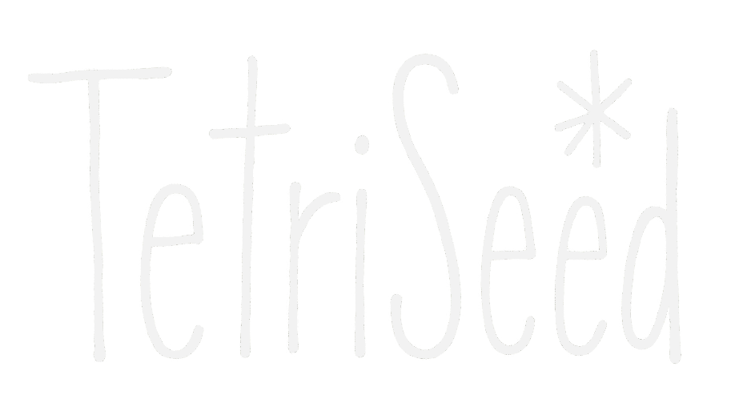

# TetriSeed

[](LICENSE)
[](https://reactjs.org/)
[](https://nodejs.org/)

<p align="center">
  
</p>

A Tetris game with a SuperSeed DeFi protocol theme. Clear your debt by clearing rows and climb the leaderboard!

## README FILES OF THE PROJECT:
- [Detailed Game Documentation - this file](./src/README.md)
- [Server Documentation](./server/README.md)
- [Smart Contracts Documentation](./contracts/README.md)
- [Admin Dashboard Documentation](./dashboard/README.md)


## 🧞‍♂️ Prompts used:
- [GitHub backup](https://github.com/JesCR/TetriSeed/tree/main/.specstory/history)
- [MVP](https://share.specstory.com/stories/8adc6ede-fd57-448b-81e6-c633aea82180)
- [Competitive mode](https://share.specstory.com/stories/13af7b26-946d-4d59-ad79-2c9100332c51)
- [Adding domain tetriseed.xyz](https://chatgpt.com/share/67eaf5d7-0b70-8003-a4c7-c6639a61f87a)
- [Fixes, Mainnet, Best UI/UX](https://share.specstory.com/stories/1221b13d-b474-49d9-99e5-0a8edab2fe1a)
- [First Smart Contract, finding prompts](https://chatgpt.com/share/67ece76a-0c4c-8003-96d5-96ac58aee7d6)
- [Smart Contract Development Project Decision](https://share.specstory.com/stories/12bc67f7-5b69-4c48-9f97-ebcfbd2a42b0)
- [Adjust tetris falling speed](https://share.specstory.com/stories/6cba4295-9580-4a79-a6fb-fc0b9d5c8e90)
- [Implement Next Piece Display](https://share.specstory.com/stories/87c27cfb-b86d-40c3-89f9-7325b7e8e241)
- [UI/UX, fast drop, footer, bugs fixing](https://share.specstory.com/stories/194ce98e-832f-49bf-92fb-db1f32a0a5a7)
- [Row clearing effects, bugs and UI/UX improvements](https://share.specstory.com/stories/b41432de-cb0d-43e3-a581-ddf353f577d5)
- [Smart Contract deploy and new Admin Dashboard](https://share.specstory.com/stories/fd237738-3fdc-4726-bd66-ee9be853c6da)


## 📋 Table of Contents

- [Demo](#-demo)
- [Overview](#-overview)
- [Components](#-components)
  - [Game Frontend](#game-frontend)
  - [Server](#server)
  - [Smart Contracts](#smart-contracts)
  - [Admin Dashboard](#admin-dashboard)
- [Installation](#-installation)
  - [Game Setup](#game-setup)
  - [Server Setup](#server-setup)
  - [Contracts Deployment](#contracts-deployment)
  - [Dashboard Setup](#dashboard-setup)
- [Game Controls](#-game-controls)
- [Competitive Mode](#-competitive-mode)
- [Technologies](#-technologies)
- [Architecture](#-architecture)
- [Troubleshooting](#-troubleshooting)
- [Contributing](#-contributing)
- [License](#-license)
- [Deployment](#-deployment)

## 🎮 Demo

[Play TetriSeed Online](https://tetriseed.xyz) - Experience the game live!


## 📖 Overview

TetriSeed is a blockchain-integrated Tetris game with a SuperSeed DeFi protocol theme. The project consists of four main components:

1. **Game Frontend**: The main Tetris game with casual and competitive modes
2. **Backend Server**: Manages leaderboards, scores, and player data
3. **Smart Contracts**: Handles competitive mode entry fees and prize distribution
4. **Admin Dashboard**: Contract management interface for administrative operations

This project showcases the integration of traditional gaming with blockchain technology, allowing players to compete for real rewards in a seasonal competition system.

## 🧩 Components

### Game Frontend

The game frontend is built with React and Vite, offering two gameplay modes:

- **Casual Mode**: Free-to-play mode without blockchain integration
- **Competitive Mode**: Blockchain-integrated mode requiring entry fees and offering prizes

[Detailed Game Documentation](./src/README.md)

### Server

The server component handles:
- Score tracking and leaderboard management
- User authentication
- Season management
- Data persistence

[Server Documentation](./server/README.md)

### Smart Contracts

The smart contracts handle the financial aspects of the competitive mode:

- Entry fee collection in ETH
- Prize pool management
- Automated season transitions
- Prize distribution to top players

[Smart Contracts Documentation](./contracts/README.md)

### Admin Dashboard

The admin dashboard provides contract owners with:

- Contract monitoring (entry fees, prize pools, etc.)
- Administrative functions (update fees, distribute prizes)
- Season management
- Security controls

[Admin Dashboard Documentation](./dashboard/README.md)

## 💻 Installation

### Prerequisites

- [Node.js](https://nodejs.org/) (v14.0.0 or higher)
- [npm](https://www.npmjs.com/) (v6.0.0 or higher)
- [Git](https://git-scm.com/)
- [MetaMask](https://metamask.io/) wallet (for competitive mode and contract deployment)
- Access to the SuperSeed network (for competitive mode)

### Game Setup

1. **Clone the repository**:
   ```bash
   git clone https://github.com/JesCR/SuperSeedSuperGame.git
   cd SuperSeedSuperGame
   ```

2. **Install dependencies**:
   ```bash
   npm install
   ```

3. **Configure environment variables**:
   Create a `.env` file in the project root:
   ```
   VITE_SERVER_URL=http://localhost:3000
   VITE_CONTRACT_ADDRESS=0xd9b4190777287eAD1473A5EE44aA2a6aAE3b7b42
   ```

4. **Start the development server**:
   ```bash
   npm run dev
   ```

   The game will be available at `http://localhost:5173`

### Server Setup

1. **Navigate to the server directory**:
   ```bash
   cd server
   ```

2. **Install server dependencies**:
   ```bash
   npm install
   ```

3. **Configure server environment**:
   Create a `.env` file in the server directory:
   ```
   PORT=3000
   DB_PATH=./data
   ALLOWED_ORIGINS=http://localhost:5173,https://tetriseed.xyz
   ```

4. **Start the server**:
   ```bash
   node index.js
   ```

   The server will run on port 3000 by default.

### Contracts Deployment

1. **Navigate to the contracts directory**:
   ```bash
   cd contracts
   ```

2. **Install smart contract dependencies**:
   ```bash
   npm install
   ```

3. **Configure deployment parameters**:
   Create a `.env` file:
   ```
   PRIVATE_KEY=your_wallet_private_key_here
   ```

4. **Compile the contracts**:
   ```bash
   npx hardhat compile
   ```

5. **Deploy to the SuperSeed Sepolia testnet**:
   ```bash
   npx hardhat run scripts/deploy-eth.js --network superseedSepolia
   ```

   After deployment, note the contract address for frontend integration.

### Dashboard Setup

1. **Navigate to the dashboard directory**:
   ```bash
   cd dashboard
   ```

2. **Install dashboard dependencies**:
   ```bash
   npm install
   ```

3. **Configure the dashboard**:
   Create a `.env` file:
   ```
   REACT_APP_CONTRACT_ADDRESS=0xd9b4190777287eAD1473A5EE44aA2a6aAE3b7b42
   ```

4. **Start the dashboard**:
   ```bash
   npm start
   ```

   The dashboard will be available at `http://localhost:3000`

## 🎮 Game Controls

### Keyboard Controls

- **Left Arrow / A**: Move tetromino left
- **Right Arrow / D**: Move tetromino right
- **Down Arrow / S**: Move tetromino down (soft drop)
- **Space**: Hard drop (instant placement)
- **Up Arrow / W**: Rotate tetromino clockwise

### Touch Controls (Mobile)

- **Swipe Left**: Move tetromino left
- **Swipe Right**: Move tetromino right
- **Swipe Down**: Soft drop tetromino
- **Swipe Up / Tap**: Rotate tetromino

## 🏆 Competitive Mode

TetriSeed's competitive mode offers a blockchain-integrated gaming experience:

### How It Works

1. **Connect Wallet**: Use MetaMask to connect to SuperSeed Sepolia network
2. **Pay Entry Fee**: Entry costs 0.0001 ETH per game
3. **Play & Compete**: Your highest score is recorded on the leaderboard
4. **Seasonal Rewards**: At the end of each week (season), prizes are distributed

### Prize Distribution

- **1st Place**: 50% of the prize pool
- **2nd Place**: 30% of the prize pool
- **3rd Place**: 10% of the prize pool
- **4th Place**: 5% of the prize pool
- **5th Place**: 5% of the prize pool

### Season Schedule

- Each season runs from Monday 00:00 UTC to Sunday 23:59 UTC
- After each season ends, prizes are distributed and a new season begins
- Season history is viewable in the game interface

## 🔧 Technologies

### Frontend
- **React 18**: UI library
- **Vite**: Build tool and development server
- **Ethers.js**: Ethereum wallet integration
- **Web3Modal**: Wallet connection
- **SCSS**: Styling

### Backend
- **Node.js**: Runtime environment
- **Express**: Web server framework
- **CSV Storage**: Lightweight data persistence
- **Socket.io**: Real-time updates

### Smart Contracts
- **Solidity**: Contract programming language
- **Hardhat**: Development environment
- **OpenZeppelin**: Contract security libraries
- **Ethers.js**: Contract interaction

### Admin Dashboard
- **React**: UI library
- **Ethers.js**: Blockchain interaction
- **Web3Modal**: Wallet authentication

## 🏗 Architecture

The TetriSeed architecture consists of:

```
SuperSeedSuperGame/
├── src/                     # Game frontend code
│   ├── assets/              # Images, sounds, and other static files
│   ├── components/          # React components
│   ├── hooks/               # Custom React hooks
│   └── utils/               # Utility functions including Web3 integration
├── server/                  # Backend server
│   ├── index.js             # Main server file
│   ├── routes/              # API routes
│   └── data/                # Data storage
├── contracts/               # Smart contracts
│   ├── contracts/           # Solidity contract files
│   ├── scripts/             # Deployment scripts
│   └── test/                # Contract tests
└── dashboard/               # Admin dashboard
    ├── src/                 # Dashboard source code
    └── public/              # Static assets
```

### Data Flow

1. **Game Initialization**:
   - Frontend loads assets and connects to server
   - If competitive mode, connects to wallet and smart contract

2. **Gameplay**:
   - Game state managed client-side
   - Scores submitted to server via API
   - Competitive play verified through blockchain

3. **Season End**:
   - Contract owner uses admin dashboard
   - Smart contract distributes prizes
   - Leaderboard resets for new season

## ❓ Troubleshooting

### Common Game Issues

#### Game Not Loading
- Check browser console for errors
- Ensure all dependencies are installed
- Try clearing cache and reloading

#### Wallet Connection Problems
- Verify MetaMask is installed and unlocked
- Check you're on the SuperSeed Sepolia network (Chain ID: 53302)
- If the network is missing, add it manually:
  - Network Name: SuperSeed Sepolia
  - RPC URL: https://sepolia.superseed.xyz
  - Chain ID: 53302
  - Currency Symbol: ETH

#### Leaderboard Not Updating
- Ensure the server is running
- Check server logs for API errors
- Verify network connectivity

### Contract Issues

#### Failed Transactions
- Ensure you have enough ETH for gas
- Check transaction parameters
- Verify you have the correct permissions (for admin functions)

#### Prize Distribution Errors
- Ensure all winner addresses are valid
- Check prize pool has sufficient funds
- Verify season has ended

### Server Issues

#### Server Won't Start
- Check for port conflicts
- Ensure all dependencies are installed
- Verify node version (`node -v`) is 14.0.0 or higher

#### Data Persistence Problems
- Check file permissions in the data directory
- Ensure CSV files are not corrupted
- Backup data before any server modifications

## 🤝 Contributing

We welcome contributions to the TetriSeed project:

1. Fork the repository
2. Create a feature branch (`git checkout -b feature/amazing-feature`)
3. Commit your changes (`git commit -m 'Add amazing feature'`)
4. Push to the branch (`git push origin feature/amazing-feature`)
5. Open a Pull Request

Please read [CONTRIBUTING.md](./CONTRIBUTING.md) for detailed guidelines.

## 📄 License

This project is licensed under the MIT License - see the [LICENSE](./LICENSE) file for details.

## 🚀 Deployment

### Game Deployment

To build the game for production:

```bash
npm run build
```

This creates a `dist` directory with optimized files ready for deployment to any static hosting service.

### Server Deployment

For production server deployment:

```bash
cd server
npm install --production
NODE_ENV=production node index.js
```

Consider using a process manager like PM2:

```bash
npm install -g pm2
pm2 start index.js --name tetriseed-server
```

### Contract Verification

After deployment, verify your contract on block explorers:

```bash
npx hardhat verify --network superseedSepolia 0xd9b4190777287eAD1473A5EE44aA2a6aAE3b7b42
```

### Dashboard Deployment

Build the dashboard for production:

```bash
cd dashboard
npm run build
```

The resulting `build` directory can be deployed to any static hosting service.

---

<p align="center">
  Made with ❤️ for the SuperSeed community
</p>