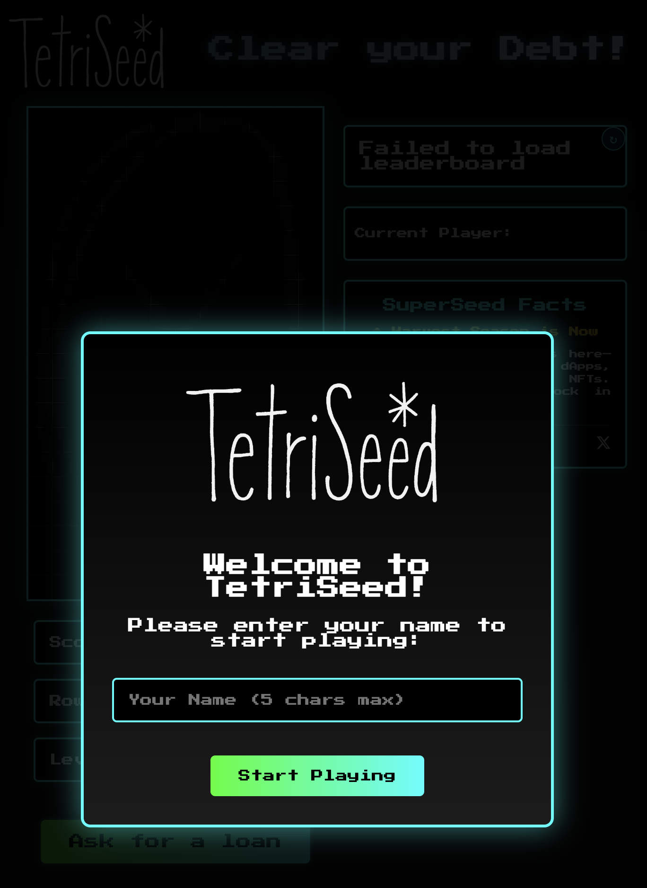

# TetriSeed

[](LICENSE)
[](https://reactjs.org/)
[](https://nodejs.org/)

<p align="center">
  
</p>

A Tetris game with a SuperSeed DeFi protocol theme. Clear your debt by clearing rows and climb the leaderboard!

## 🧞‍♂️ Prompts used:
- [GitHub backup](https://github.com/JesCR/TetriSeed/tree/main/.specstory/history)
- [MVP](https://share.specstory.com/stories/8adc6ede-fd57-448b-81e6-c633aea82180)
- [Competitive mode](https://share.specstory.com/stories/13af7b26-946d-4d59-ad79-2c9100332c51)
- [Adding domain tetriseed.xyz](https://chatgpt.com/share/67eaf5d7-0b70-8003-a4c7-c6639a61f87a)
- [Fixes, Mainnet, Best UI/UX](https://share.specstory.com/stories/1221b13d-b474-49d9-99e5-0a8edab2fe1a)
- [First Smart Contract, finding prompts](https://chatgpt.com/share/67ece76a-0c4c-8003-96d5-96ac58aee7d6)

## 📋 Table of Contents

- [Demo](#-demo)
- [Features](#-features)
- [Prerequisites](#-prerequisites)
- [Installation](#-installation)
- [Running the Game](#-running-the-game)
- [Game Controls](#-game-controls)
- [Project Structure](#-project-structure)
- [Technologies](#-technologies)
- [Troubleshooting](#-troubleshooting)
- [Contributing](#-contributing)
- [License](#-license)
- [Deployment](#-deployment)

## 🎮 Demo

[Play TetriSeed Online](#) - [v1 here](http://163.172.111.148:5173/)

<p align="center">
  
</p>

## ✨ Features

- **Classic Tetris Gameplay** with a financial twist
- **Debt-themed mechanics**: Clear rows to reduce your debt
- **Increasing interest rates** as you level up
- **Two Game Modes**: Casual and Competitive
- **MetaMask Wallet Integration** for competitive gameplay
- **Seasonal Competitions** with weekly prize pools
- **Prize Distribution System** for top players
- **Global Leaderboard** to compete with other players
- **Mobile touch support** for playing on the go
- **SuperSeed Facts** displaying information about the SuperSeed protocol

## 🔍 Prerequisites

Before you begin, ensure you have the following installed on your system:

- [Node.js](https://nodejs.org/) (version 18.x or higher)
- [npm](https://www.npmjs.com/) (usually comes with Node.js)
- A modern web browser (Chrome, Firefox, Safari, or Edge)

## 💻 Installation

Follow these steps to get your development environment running:

### 1. Clone the repository

```bash
git clone https://github.com/JesCR/TetriSeed.git
cd TetriSeed
```

### 2. Install dependencies

The project is split into client-side and server-side code, both requiring their own dependencies.

```bash
# Install all dependencies (client and server)
npm install
```

## 🚀 Running the Game

TetriSeed consists of both a client (frontend) and server (backend) component. You need to run both to have a fully functioning game with leaderboard functionality.

### Development Mode

#### Start the server (backend)

```bash
# Navigate to the server directory
cd server

# Start the server
node index.js
```

You should see output indicating the server is running, typically on port 3000.

#### Start the client (frontend)

Open a new terminal window/tab and run:

```bash
# In the project root directory
npm start
```

This will start the development server, typically on port 5173. The game should automatically open in your default web browser.

### Production Mode

To build the client for production:

```bash
npm run build
```

This creates an optimized production build in the `dist` directory.

To serve the production build:

```bash
# After building
npm run serve
```

## 🎮 Game Controls

### Keyboard Controls

- **Left Arrow / A**: Move tetromino left
- **Right Arrow / D**: Move tetromino right
- **Down Arrow / S**: Move tetromino down (soft drop)
- **Up Arrow / W**: Rotate tetromino clockwise

### Touch Controls (Mobile)

- **Swipe Left**: Move tetromino left
- **Swipe Right**: Move tetromino right
- **Swipe Down**: Soft drop tetromino
- **Swipe Up / Tap**: Rotate tetromino

### Game Modes

- **Casual Mode**: Play freely without any wallet connection
- **Competitive Mode**: Connect your MetaMask wallet to enter competitive mode, pay 1 $SUPR per game, and compete for weekly prizes

## 🏆 Competitive Mode

TetriSeed features a competitive mode where players can compete for real rewards:

- Players pay 1 $SUPR token per game to enter competitive mode
- All entry fees are collected in a smart contract prize pool
- Each season lasts one week (Monday to Sunday)
- At the end of each season, prizes are distributed to the top 5 players:
  - 1st place: 50% of the prize pool
  - 2nd place: 30% of the prize pool
  - 3rd place: 10% of the prize pool
  - 4th place: 5% of the prize pool
  - 5th place: 5% of the prize pool
- After each season, the leaderboard is reset for a new competition

## 📁 Project Structure

```
TetriSeed/
├── public/                  # Static files
│   └── data/                # Data files for the game
│       ├── leaderboard.csv  # Casual mode leaderboard data
│       ├── competitive.csv  # Competitive mode leaderboard data
│       └── seasons.json     # Season history data
├── server/                  # Server-side code
│   └── index.js             # Express server implementation
├── src/                     # Client-side source code
│   ├── assets/              # Images and other assets
│   ├── components/          # React components
│   │   ├── CompetitiveMode.jsx  # Wallet connection and competitive mode
│   │   ├── SeasonInfo.jsx       # Current season information
│   │   ├── SeasonHistory.jsx    # Past seasons history
│   │   └── ...              # Other components
│   ├── hooks/               # Custom React hooks
│   ├── utils/               # Utility functions
│   │   ├── web3Utils.js     # MetaMask and blockchain utilities
│   │   └── ...              # Other utilities
│   ├── App.jsx              # Main App component
│   ├── index.css            # Global styles
│   └── main.jsx             # Entry point
├── .gitignore               # Git ignore file
├── package.json             # Project dependencies
├── README.md                # This file
└── vite.config.js           # Vite configuration
```

## 🔧 Technologies

TetriSeed is built with modern web technologies:

- [React](https://reactjs.org/) - Frontend framework
- [Vite](https://vitejs.dev/) - Build tool and development server
- [Node.js](https://nodejs.org/) - JavaScript runtime
- [Express](https://expressjs.com/) - Web server framework
- [MetaMask](https://metamask.io/) - Wallet connection for Ethereum blockchain
- [Ethers.js](https://docs.ethers.org/) - Ethereum wallet interaction library
- [csv-parser](https://github.com/mafintosh/csv-parser) - CSV parsing library

## ❓ Troubleshooting

### Common Issues and Solutions

#### Port already in use

If you see an error like `Error: listen EADDRINUSE: address already in use :::3000`:

```bash
# Kill the process using the port (on Unix/Mac)
pkill -f "node.*server"

# Or for Windows
netstat -ano | findstr :3000
taskkill /PID <PID> /F
```

#### Leaderboard not loading

Make sure:
1. The server is running
2. The `public/data` directory exists and is writable
3. Check for errors in the browser console or server logs

#### MetaMask Connection Issues

If you're having trouble connecting your MetaMask wallet:

1. Ensure MetaMask is installed and unlocked
2. Make sure you're on a supported network (SuperSeed network)
3. If the network is not available, the game will prompt you to add it
4. Check for console errors related to wallet connection
5. Try refreshing the page and reconnecting

#### Competitive Mode Not Working

If competitive mode isn't working:

1. Ensure your MetaMask wallet is properly connected
2. Make sure you have sufficient $SUPR tokens for game entry
3. Check the network connection to the SuperSeed blockchain
4. See browser console for more detailed error messages

## 🎯 Contributing

Contributions are welcome! If you'd like to contribute to TetriSeed, please follow these steps:

1. Fork the repository
2. Create a new branch for your feature or bug fix
3. Make your changes and commit them
4. Push your changes to your fork
5. Open a pull request

## 📄 License

TetriSeed is licensed under the MIT License. See the [LICENSE](LICENSE) file for more information.

## 🔗 Related Projects

- [SuperSeed DeFi Protocol](https://superseed.xyz/) - The DeFi protocol that inspired this game
- [Optimism Superchain](https://www.optimism.io/) - The Layer 2 solution where SuperSeed operates

## 🚀 Deployment

### Deploying to Netlify

TetriSeed can be easily deployed to Netlify for free hosting:

1. Build the production version:
   ```bash
   npm run build
   ```

2. Deploy using one of these methods:

   **Method 1: Direct upload** (Quick testing)
   - Go to [Netlify's dashboard](https://app.netlify.com/)
   - Sign up or log in
   - Drag and drop the `dist` folder to the upload area
   - Netlify will deploy your site and provide a URL

   **Method 2: Connect to Git repository** (Continuous deployment)
   - Create a new site in Netlify
   - Connect your GitHub repository
   - Set build command to `npm run build`
   - Set publish directory to `dist`
   - Deploy the site

### Setting Up the Backend Server

For the leaderboard functionality to work, you'll need to deploy the server component:

1. Deploy the server to a platform like [Render](https://render.com/), [Railway](https://railway.app/), or [Heroku](https://www.heroku.com/).

2. Update the server URL in the API configuration:
   - Open `src/utils/apiConfig.js`
   - Replace the placeholder URL with your actual deployed server URL:
     ```javascript
     const API_URL = {
       development: '', // Empty for development (uses proxy)
       production: 'https://your-actual-server-url.com' // ← Update this
     };
     ```

3. Rebuild and redeploy the frontend after updating the API URL.

### Testing Deployed API Endpoints

After deployment, you can test that your API endpoints are working:

1. Visit your deployed frontend URL
2. Open the browser's developer tools (F12)
3. Check the Network tab when the game loads
4. Verify that requests to `/api/leaderboard` and `/api/competitive-leaderboard` are successfully connecting to your server

If there are issues with CORS, ensure your server is properly configured to accept requests from your Netlify domain.

---

<p align="center">
  Made with ❤️ for the SuperSeed community
</p>